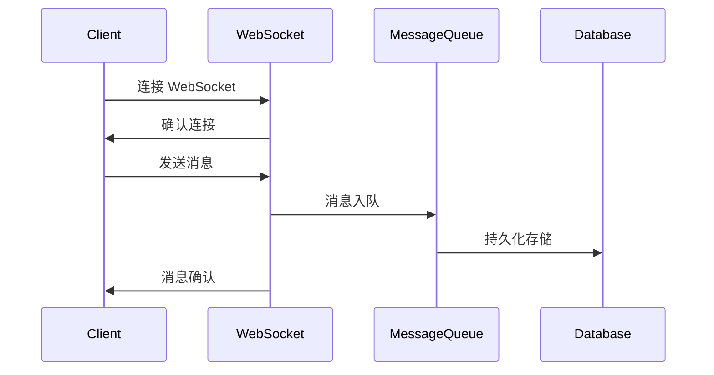
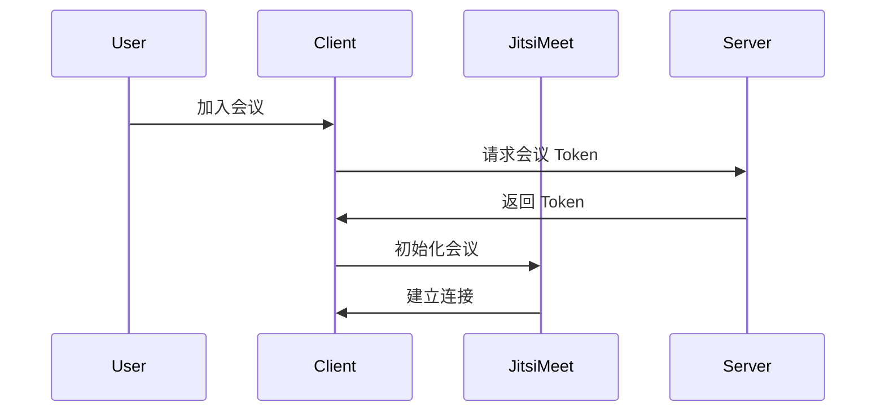

# WeMaster 系统架构文档

## 系统架构概览

WeMaster 采用 Monorepo 架构，使用 Turborepo 进行包管理。系统分为以下主要模块：

### 核心模块

1. **前端应用 (apps/web)**
   - Next.js + React 构建的 Web 应用
   - 实时课堂界面
   - 用户管理界面
   - 支付系统界面

2. **后端 API (apps/api)**
   - NestJS 构建的 RESTful API
   - WebSocket 服务
   - 数据库交互
   - 第三方服务集成

3. **实时通讯模块**
   - WebSocket 服务
   - 消息队列
   - 实时通知系统

4. **视频会议系统**
   - Jitsi Meet 集成
   - 实时音视频
   - 屏幕共享
   - 会议录制

### 数据存储

1. **主数据库 (PostgreSQL)**
   - 用户数据
   - 课程信息
   - 支付记录
   - 系统配置

2. **缓存系统 (Redis)**
   - 会话管理
   - 实时消息缓存
   - 系统缓存
   - 任务队列

### 微服务模块

1. **支付服务**
   - 支付处理
   - 退款管理
   - 账户余额
   - 交易记录

2. **消息服务**
   - 即时消息
   - 系统通知
   - 邮件发送
   - 消息模板

3. **直播服务**
   - 直播流管理
   - 录制服务
   - 回放功能
   - 互动功能

## 模块交互

### 实时通讯流程

### 视频会议流程

## 部署架构

### 生产环境

1. **前端部署**
   - Vercel 平台
   - 全球 CDN
   - 自动化部署
   - SSL 证书

2. **后端部署**
   - 专用服务器/云服务
   - 负载均衡
   - 自动扩展
   - 数据备份

3. **数据库部署**
   - 主从复制
   - 定时备份
   - 监控告警
   - 容灾恢复

### 开发环境

1. **本地开发**
   - Docker 容器化
   - 热重载
   - 开发工具配置
   - 测试环境

2. **CI/CD 流程**
   - GitHub Actions
   - 自动化测试
   - 代码质量检查
   - 自动部署

## 安全措施

1. **用户认证**
   - JWT 令牌
   - OAuth2.0
   - 双因素认证
   - 会话管理

2. **数据安全**
   - 数据加密
   - HTTPS
   - 防火墙
   - 访问控制

3. **监控告警**
   - 日志收集
   - 性能监控
   - 异常告警
   - 安全审计

## 扩展性设计

1. **水平扩展**
   - 服务无状态
   - 负载均衡
   - 分布式缓存
   - 数据分片

2. **垂直扩展**
   - 模块化设计
   - 插件系统
   - API 版本控制
   - 服务解耦

## 后续规划

1. **功能增强**
   - 离线消息支持
   - 消息已读状态
   - 消息撤回功能
   - 富文本消息
   - 文件传输
   - 表情包系统

2. **性能优化**
   - Redis 消息缓存
   - 消息分页加载
   - WebSocket 心跳检测
   - 消息压缩
   - 图片优化
   - CDN 加速

3. **运维改进**
   - 监控系统完善
   - 日志分析
   - 自动化运维
   - 容灾备份
